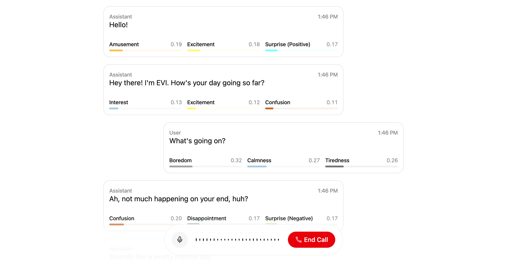

<div align="center">
  <h1>🎓 Senivio - AI Dil Eğitmeni</h1>
  <p><strong>Sesli İngilizce öğretmeni ile pratik yapın</strong></p>
</div>



## 📖 Genel Bakış

Senivio, Hume AI'nin [Empathic Voice Interface](https://hume.docs.buildwithfern.com/docs/empathic-voice-interface-evi/overview) teknolojisini kullanarak geliştirilmiş bir sesli İngilizce öğretmeni uygulamasıdır. Next.js App Router ile geliştirilmiş bu uygulama, kullanıcıların sesli olarak İngilizce pratik yapmasını sağlar.

## ✨ Özellikler

- 🎤 **Sesli Konuşma**: Gerçek zamanlı ses tanıma ve sentezleme
- 🧠 **AI Öğretmen**: Yapay zeka destekli İngilizce öğretmeni
- 📱 **Modern UI**: Responsive ve kullanıcı dostu arayüz
- 🌙 **Tema Desteği**: Açık/koyu tema seçenekleri
- 🎯 **Kişiselleştirilmiş Öğrenme**: Seviyeye uygun dersler

## 🚀 Kurulum

### Gereksinimler

- Node.js 18+ 
- Hume AI hesabı ve API anahtarları

### Adımlar

1. **Projeyi klonlayın**
   ```bash
   git clone https://github.com/uzeyirrr/ai-dil-egitmeni.git
   cd ai-dil-egitmeni
   ```

2. **Bağımlılıkları yükleyin**
   ```bash
   npm install
   # veya
   pnpm install
   ```

3. **Environment değişkenlerini ayarlayın**
   
   `.env.local` dosyası oluşturun:
   ```env
   HUME_API_KEY=your_hume_api_key
   HUME_SECRET_KEY=your_hume_secret_key
   ```

4. **Uygulamayı çalıştırın**
   ```bash
   npm run dev
   # veya
   pnpm dev
   ```

5. **Tarayıcıda açın**
   ```
   http://localhost:3000
   ```

## 🔧 Teknolojiler

- **Frontend**: Next.js 14, React 18, TypeScript
- **UI**: Tailwind CSS, Radix UI, Framer Motion
- **AI**: Hume AI Voice Interface
- **Deployment**: Vercel (önerilen)

## 📝 API Anahtarları

Hume AI API anahtarlarını almak için:

1. [Hume AI Portal](https://beta.hume.ai/)'a giriş yapın
2. [API Keys](https://beta.hume.ai/settings/keys) sayfasına gidin
3. API Key ve Secret Key'inizi alın
4. `.env.local` dosyasına ekleyin

## 🌐 Deployment

### Vercel ile Deploy

[](https://vercel.com/new/clone?repository-url=https%3A%2F%2Fgithub.com%2Fuzeyirrr%2Fai-dil-egitmeni&env=HUME_API_KEY,HUME_SECRET_KEY)

1. Yukarıdaki butona tıklayın
2. GitHub repository'nizi seçin
3. Environment değişkenlerini ekleyin:
   - `HUME_API_KEY`
   - `HUME_SECRET_KEY`
4. Deploy edin

## 🤝 Katkıda Bulunma

1. Bu repository'yi fork edin
2. Feature branch oluşturun (`git checkout -b feature/amazing-feature`)
3. Değişikliklerinizi commit edin (`git commit -m 'Add amazing feature'`)
4. Branch'inizi push edin (`git push origin feature/amazing-feature`)
5. Pull Request oluşturun

## 📄 Lisans

Bu proje MIT lisansı altında lisanslanmıştır.

## 🆘 Destek

Sorularınız için:
- [GitHub Issues](https://github.com/uzeyirrr/ai-dil-egitmeni/issues)
- [Hume AI Discord](https://link.hume.ai/discord)

---

<div align="center">
  <p>Made with ❤️ by <a href="https://github.com/uzeyirrr">uzeyirrr</a></p>
</div>
